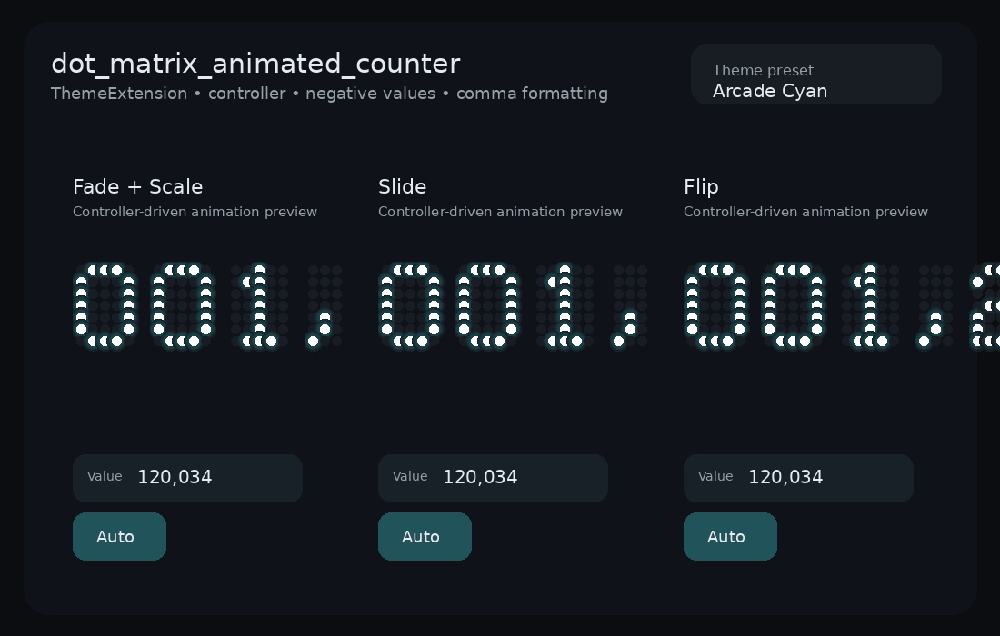

# dot_matrix_animated_counter

[](https://github.com/dexter-cnx/dot_matrix_animated_counter/actions/workflows/github-pages.yml)
[Live demo](https://dexter-cnx.github.io/dot_matrix_animated_counter/)

Animated dot-matrix counters for Flutter with:

- controller-driven updates
- `ThemeExtension`-based styling
- `fadeScale`, `slide`, and `flip` transitions
- negative number support
- comma/grouping formatting



## Installation

```yaml
dependencies:
  dot_matrix_animated_counter: ^0.2.0
```

## Quick start

```dart
final controller = DotMatrixCounterController(initialValue: 1234);

MaterialApp(
  theme: DotMatrixCounterTheme.apply(
    ThemeData.dark(),
    const DotMatrixCounterThemeData(
      glowColor: Colors.cyanAccent,
      animationStyle: DotMatrixAnimationStyle.slide,
    ),
  ),
  home: Scaffold(
    body: Center(
      child: DotMatrixAnimatedCounter(
        controller: controller,
        digitCount: 7,
        padWithZeros: true,
        useGrouping: true,
      ),
    ),
  ),
)
```

## Theming with ThemeExtension

```dart
final appTheme = DotMatrixCounterTheme.apply(
  ThemeData.dark(),
  const DotMatrixCounterThemeData(
    dotSize: 10,
    dotSpacing: 3,
    digitSpacing: 10,
    glowColor: Colors.orangeAccent,
    onColor: Colors.white,
    offColor: Color(0xFF221B18),
    animationStyle: DotMatrixAnimationStyle.flip,
  ),
);
```

You can also apply a local override:

```dart
DotMatrixCounterTheme(
  data: const DotMatrixCounterThemeData(
    glowColor: Colors.greenAccent,
  ),
  child: const DotMatrixAnimatedCounter(value: 42),
)
```

## Main API

```dart
DotMatrixAnimatedCounter(
  controller: controller,
  digitCount: 7,
  padWithZeros: true,
  useGrouping: true,
  theme: const DotMatrixCounterThemeData(
    animationStyle: DotMatrixAnimationStyle.fadeScale,
  ),
)
```

### Parameters

- `value` or `controller`: source of the integer value
- `digitCount`: minimum numeric digits before sign/grouping are added
- `padWithZeros`: left-pad digits with `0`
- `useGrouping`: add comma separators
- `groupingSeparator`: override the grouping character
- `theme`: optional local theme override

## Controller

```dart
controller.increment();
controller.decrement();
controller.setValue(-123456);
controller.reset();
```

## Example app

The bundled example demonstrates:

- theme preset selection
- controller-based updates
- negative and comma-formatted values
- each animation style side-by-side

